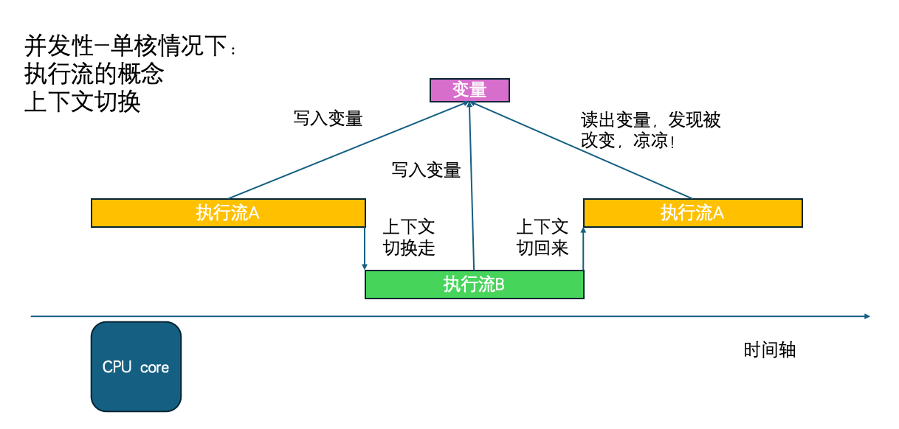
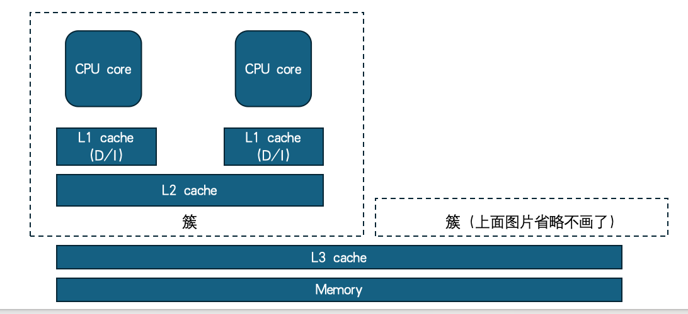
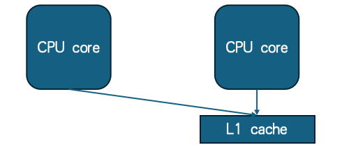
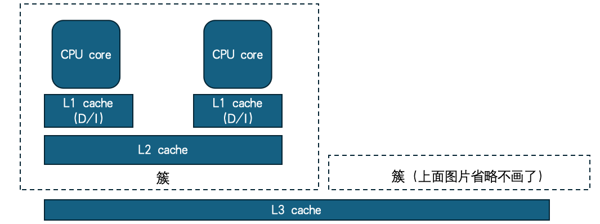
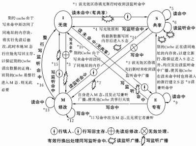
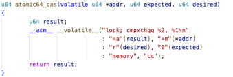
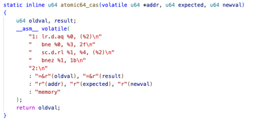
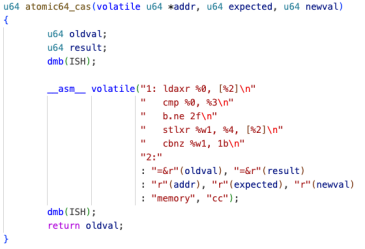
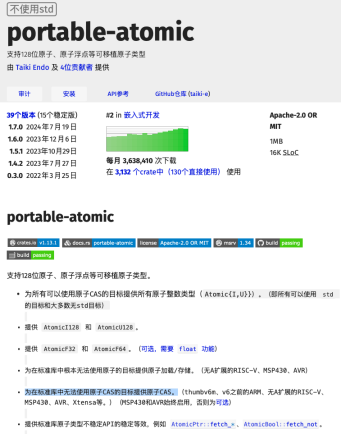

# 写一个"真正的"操作系统内核,你需要想清楚这四件事
> 本文整理自操作系统内核开发分享(主讲:朱懿)，面向参加操作系统能力挑战赛（OSCOMP）或希望深入内核开发的同学。
课堂上讲的并发、共享、异步、虚拟，是从"用户视角"理解 OS 提供了什么能力。但当你坐下来写内核，视角完全反转——你需要亲手实现这些能力，而且要在一个"什么都还没有"的环境里从零构建。
> 教科书通常从"OS 提供了什么"的角度归纳出并发、共享、异步、虚拟四大特性。本文换一个角度，聚焦于**实现**内核时最容易被低估的四个维度：**并发性、自组织性、框架性、防御性**。它们和教科书的分类并不一一对应，但都是真正动手写内核时会反复踩坑的地方。
---
## 一、并发性：不只是"跑多个程序"那么简单
### 1.1 概念上的并发 vs 实现上的并发
学概念时，并发的含义是"OS 向上层封装了多个程序同时运行的能力"。但写 OS 时，并发意味着：**你必须时刻假设，任何一个变量都可能在你不知道的时候被其他核心、其他执行流修改掉。**

这是一种思维方式的转变，不是加几把锁那么简单。
### 1.2 单核系统中的并发模型：执行流与上下文切换机制
在单核处理器中，虽然物理上同一时刻只能运行一个线程，但通过操作系统的调度机制（如时间片轮转、中断驱动），多个执行流可以“宏观并行、微观串行”地交替执行，从而形成“并发”的假象。

单核并发的核心问题是**中断与抢占**：一个线程在执行过程中可能随时被硬件中断或操作系统抢占，导致其执行流被暂停，转而执行另一个线程。这种非自愿的上下文切换可能导致共享数据的不一致，即“竞态条件”。



*图 1：单核系统下因中断导致的上下文切换与数据竞争示例*

> **图注**：执行流 A 在写入变量后被中断，执行流 B 修改了该变量；当 A 恢复时读取到过期值，引发逻辑错误。
理解单核并发需掌握两个基础概念：

* **执行流（Execution Flow）**：指内核中每一个独立的控制流单元，包括用户线程、内核线程、中断处理程序、软中断、工作队列等。它们共享相同的地址空间，但拥有独立的栈和寄存器上下文。 * **上下文切换（Context Switch）**：指操作系统保存当前执行流的 CPU 寄存器状态（如 PC、SP、通用寄存器等），并恢复另一个执行流的状态，从而实现控制权转移。这是实现多任务并发的基础机制，但也带来一定的性能开销（缓存失效、TLB 刷新等）。
在单核系统中，保护共享资源的常用手段有两种：
1. **关闭中断（Disable Interrupts）**：在进入临界区前临时关闭本地 CPU 的中断，确保不会被中断打断。适用于极短的临界区（如更新全局计数器），但不适用于长耗时操作，否则会影响系统实时性。 2. **加锁（Locking）**：使用自旋锁或互斥锁保护共享数据结构。在单核环境下，若使用自旋锁需注意避免在中断上下文中持锁，以防死锁。
> 💡 **注意**：上述方法仅适用于单核系统。在多核系统中，关闭本地中断无法阻止其他核心访问共享内存，因此必须依赖原子指令（如 LL/SC、CAS）或总线锁来实现真正的互斥。
### 1.3 多核并发：三个层次的挑战

多核才是真正复杂的地方。多个 CPU 核心真正同时运行，带来了三个层次的问题。

典型的多核处理器采用分层缓存结构，如下图所示：每个核心拥有独立的 L1 缓存（分为数据缓存和指令缓存），同一簇内的核心共享 L2 缓存，所有核心共享末级 L3 缓存，最终统一访问主存。更详细的片上互联拓扑可参考《深入理解计算机体系结构》。



*图 2：多核处理器分层缓存架构示意图*

> **图注**：展示了从 CPU Core → L1 Cache (D/I) → L2 Cache (per cluster) → L3 Cache (shared) → Memory 的完整存储层次结构。虚线框表示一个“簇”（Cluster），内部包含多个核心及其私有/共享缓存。

---

### 📌 多核并发的三大核心挑战

在多核系统中，由于多个核心可以**真正并行执行**，传统的单核保护机制（如关中断）完全失效，必须面对以下三个层面的问题：
#### 1️. 数据竞争（Data Race）
多个核心同时读写同一内存地址，若无同步机制，将导致数据不一致。这是最基础也是最常见的问题。
#### 2️. 缓存一致性（Cache Coherence）
每个核心有自己的 L1 缓存，当某个核心修改了共享变量时，其他核心的缓存副本可能过期。硬件通过 MESI/MOESI 等协议自动维护一致性，但软件仍需注意伪共享（False Sharing）等问题。
#### 3️. 内存可见性与重排序（Memory Visibility & Reordering）
编译器和 CPU 为了性能会对指令进行重排序，可能导致一个核心的写入操作在另一个核心看来“尚未发生”。需要通过内存屏障（Memory Barrier）或原子操作来保证顺序性和可见性。
> **关键区别**：
> - 单核并发 → 主要靠**禁用中断 + 锁**解决；
> - 多核并发 → 必须依赖**原子指令 + 内存屏障 + 缓存一致性协议**。
#### 层次一：乱序执行与内存模型

乱序执行本身是单核问题——编译器和 CPU 都会对指令重排以提升性能。在单核环境下，这通常不会引发问题，因为编译器会保证“看起来没有依赖关系”的指令才会被重排，程序语义保持不变。

但在多核环境下，问题变得复杂：**一个核心试图观察另一个核心的内存操作顺序，而这个顺序可能已经被本地重排**。这就导致了“本地优化”与“全局一致性”之间的冲突。



*图 3：多核环境下乱序执行引发的内存可见性问题示意图*

> **图注**：两个 CPU 核心共享同一级缓存（L1 cache），各自独立进行指令重排优化。由于缺乏同步机制，一个核心对内存的写入顺序可能被另一个核心以非预期顺序观察到，导致数据竞争与逻辑错误。该图抽象展示了多核系统中“本地重排 + 全局可见性”矛盾的核心场景。
---
### 不同架构对内存序的保证强度不同
现代处理器架构根据其设计哲学，提供了不同强度的内存模型（Memory Model）：
#### 强内存模型（如 x86 / x86_64）
硬件默认提供较强的顺序保证，唯一需要显式屏障的场景是防止 `Store → Load` 重排：
- `sfence`：保证写操作顺序（Store Fence）
- `lfence`：保证读操作顺序（Load Fence）
- `mfence`：全屏障（Memory Fence），阻止所有类型的重排序
> 在 x86 上，`memory_order_seq_cst` 通常只需插入 `mfence` 即可实现；而 `acquire/release` 往往无需额外指令（因硬件天然支持）。
#### 弱内存模型（如 ARMv8-A / RISC-V）
默认允许更激进的重排序，开发者必须手动插入屏障指令来确保正确性：
##### ARM 架构常用屏障指令：
| 指令      | 作用                   | 适用场景                                   |
|-----------|------------------------|--------------------------------------------|
| `dmb ish` | 数据内存屏障（Inner Shareable） | 保证前后内存访问的顺序                     |
| `dsb ish` | 数据同步屏障           | 等待之前所有内存访问完成后再继续           |
| `isb`     | 指令同步屏障           | 清空流水线，确保后续指令基于最新状态执行（代价最高） |

##### RISC-V 架构：

通过 `fence` 扩展实现类似功能，例如：

```asm 
fence r,w,r,w # 等价于 full barrier fence rw, w # release semantics fence r, rw # acquire semantics
``` 

🧩 上层语言提供的跨平台抽象 对于应用层开发者，C++ 和 Rust 都提供了标准化的内存序接口，屏蔽底层架构差异。 
| 内存序                | 含义                           | 对应硬件行为                               |
|-----------------------|--------------------------------|--------------------------------------------|
| `memory_order_relaxed`  | 仅保证原子性，无顺序保证       | 不插入任何屏障                             |
| `memory_order_acquire`  | 之后的读写不能重排到此加载之前 | Load 前插入 DMB（类似 DMB.ishld）          |
| `memory_order_release`  | 之前的读写不能重排到此存储之后 | Store 后插入 DMB（类似 DMB.ishst）         |
| `memory_order_acq_rel`  | 同时包含 acquire 和 release 语义 | RMW 操作前后加屏障                         |
| `memory_order_seq_cst`  | 顺序一致性，最严格             | 全屏障（类似 DMB.sy 或更强的 DSB）         | 📝 注：Rust 的 Ordering::Consume 对应 C++ 的 memory_order_consume，但因语义模糊且难以正确实现，主流编译器（如 rustc, clang）将其提升为 Acquire，实际开发中不应使用。 Rust `core::sync::atomic::Ordering`

```rust
pub enum Ordering {
    Relaxed, // 对应 memory_order_relaxed
    Acquire, // 对应 memory_order_acquire
    Release, // 对应 memory_order_release
    AcqRel,  // 对应 memory_order_acq_rel
    SeqCst,  // 对应 memory_order_seq_cst
}
```
#### 层次二：缓存一致性与可见域
现代 CPU 每个核心都有独立的 L1/L2 缓存。核心 A 修改了某个变量，核心 B 的缓存里可能还是旧值。


*图 4：典型多核处理器缓存拓扑结构*

> *图注：上图展示了典型的多核处理器缓存拓扑结构，其中每个 CPU Core 配备私有的 L1 和 L2 缓存层级。写操作局部性：Core A 执行写操作（Store）后，数据仅更新至其本地缓存层级（Local Cache Hierarchy）。读操作隔离：Core B 执行读操作（Load）时，若未触发缓存一致性协议的失效/更新机制，将直接命中其本地缓存中的旧数据副本。
此图揭示了在多核系统中，物理上的缓存隔离导致了逻辑上的内存视图不一致。解决此问题依赖于底层的缓存一致性协议（Cache Coherence Protocol, 如 MESI/MOESI）以及上层的内存屏障（Memory Barrier）指令，以强制刷新或无效化过期缓存行。*

---

### 🔁 MESI 协议：缓存一致性的基石
**MESI 协议**是最经典的缓存一致性协议，每个缓存行用两个 bit 标记状态：



*图 5：MESI 协议状态转换图*

> *图注：MESI 协议通过四个状态（Modified, Exclusive, Shared, Invalid）管理缓存行的一致性。当核心间发生读写冲突时，协议自动触发总线嗅探（Snooping）或目录式（Directory-based）机制，确保所有核心看到的数据是一致的。*
- **M（Modified）**：缓存副本已被修改，与内存不一致
- **E（Exclusive）**：缓存副本与内存一致，且只有当前核心持有
- **S（Shared）**：数据可能同时存在多个核心的缓存中，与内存一致
- **I（Invalid）**：数据无效
> 💡 **关键机制**：
> - 当 Core A 写入一个处于 `Shared` 状态的缓存行时，会广播 `Invalidate` 消息，使其他核心的该缓存行变为 `Invalid`。
> - 当 Core B 再次读取该地址时，必须从 Core A 或主存重新获取最新值。
---
### 🌍 可见域（Visibility Domain）：同步范围的代价差异

缓存一致性协议自然引出**可见域**问题：同步不同范围的缓存，代价差异很大。

#### ARM 架构的三级可见域：

| 后缀    | 含义            | 同步范围                               |
|---------|-----------------|----------------------------------------|
| `ish`   | 簇内共享 (Inner Shareable) | 同一集群内的核心（如 big.LITTLE 中的大核之间） |
| `osh`   | 外层共享 (Outer Shareable) | 包括其他集群的核心、GPU、DMA 等        |
| `sy`    | 全局共享 (System)        | 整个系统，包括所有外设和 DMA 设备      |

示例：

```asm 
dmb ish # 仅保证簇内核心间的内存序 dmb osh # 保证跨集群核心 + GPU/DMA 的内存序 dmb sy # 最严格的全局屏障
```

RISC-V 架构的可见域控制： RISC-V 通过 fence 指令的组合参数实现类似功能：

```asm
fence iorw, iorw # 等价于 full barrier (类似 dmb sy)
fence rw, w      # release semantics (类似 dmb ishst)
fence r, rw      # acquire semantics (类似 dmb ishld)
``` 
📝 注：RISC-V 还区分 POC-Harts（处理器核心）和 POC-System（整个系统），可通过扩展指令集进一步细化控制。

缓存一致性协议自然引出**可见域**问题：同步不同范围的缓存，代价差异很大。

- **ARM** 维护三个可见域：Inner（簇内）/ Outer（包括其他核心）/ 全局（含 DMA 设备等）。写 `dmb` 指令时需要加 `ish`/`osh`/`sy` 等后缀指定同步范围。
- **RISC-V** 区分 POC-System 和 POC-Harts，通过 fence 扩展等指令集扩展来控制。
关键结论：**你需要手动在合适的地方插入这些指令。**
#### 层次三：原子操作

原子操作是大多数锁的基石——保证某些操作要么全部成功，要么全部失败，中间不会被打断。它是实现无锁数据结构、自旋锁、计数器等并发原语的核心机制。
---
### 🧩 常见的原子操作类型
| 操作                      | 描述                               | 典型用途                     |
|---------------------------|------------------------------------|------------------------------|
| `load` / `store`          | 原子读写单个值                     | 读取标志位、设置状态         |
| `exchange`（swap）        | 交换两个内存中的值                 | 实现简单锁、转移所有权       |
| `fetch_add` / `fetch_sub` | 递增/减并返回原值                  | 计数器、引用计数             |
| `compare_and_exchange`（CAS） | 比较，若相等则交换，无论如何返回原值 | 无锁队列、ABA 问题解决       |
> 💡 **CAS 是最强大的原子原语之一**，它允许你“条件性地更新”一个值，是实现无锁算法的基础。
---
### ⚙️ 不同架构的原子操作实现方式
#### ✅ x86 / x86_64：依赖 `lock` 前缀 + 复杂指令集
x86 架构通过 `lock` 前缀确保多核环境下操作的原子性，并提供丰富的内置原子指令：
- `cmpxchgq`：64 位比较并交换（Compare-and-Swap）
- `xadd`：原子加并返回旧值
- `xchg`：原子交换



*图 6：x86 上的 64 位 CAS 实现示例*

>*图注：该函数使用内联汇编实现 64 位 CAS 操作。`lock cmpxchgq` 指令确保在多核环境中对该内存地址的读 - 改 - 写操作是原子的。`"memory"` 约束防止编译器重排周围指令，`"cc"` 表示影响条件码寄存器。*

```c
 u64 atomic64_cas(volatile u64 *addr, u64 expected, u64 desired) { u64 result; __asm__ volatile("lock; cmpxchgq %2, %1\n" : "=a"(result), "+m"(*addr) : "r"(desired), "0"(expected) : "memory", "cc"); return result; }
``` 
🔍 关键点： "=a"(result)：输出到 rax 寄存器（CAS 的结果总是放在 rax） "+m"(*addr)：输入输出操作数，指向目标内存地址 "0"(expected)：复用第 0 个操作数（即 rax），作为比较值 "memory"：告诉编译器此 asm 会修改内存，禁止重排 "cc"：表示会影响条件标志位（如 ZF） 

📱 ARMv8.1+（LSE 扩展）：现代原子指令支持 ARMv8.1 引入了 Large System Extensions (LSE)，提供了原生原子指令： cas, casa, casl, casal：不同内存序版本的 CAS ldadd, stadd, ldclr, stclr 等：原子加减、按位操作 对于不支持 LSE 的旧版本（ARMv7 / ARMv8.0），需使用 LL/SC 语义：

 LDREX / STREX：Load-Exclusive / Store-Exclusive LDXR / STXR：ARMv8 中的新版本，支持更多数据类型 示例（ARMv7 LL/SC 实现 CAS）：

```asm
retry:
    ldrex r1, [r0]   @ 加载独占
    cmp r1, r2       @ 比较期望值
    bne fail         @ 不等则失败
    strex r3, r4, [r0] @ 尝试存储新值
    cmp r3, #0       @ 检查是否成功
    bne retry        @ 失败则重试
fail:
    mov r0, r1       @ 返回原值
``` 
⚠️ 注意：LL/SC 可能因中断或其他核心访问而失败，需要循环重试。
🌿 RISC-V（A 扩展）：基于 LL/SC 的原子操作 RISC-V 通过 Atomic Extension (A 扩展) 提供原子操作，主要依赖： lr.w / lr.d：Load-Reserved（字/双字） sc.w / sc.d：Store-Conditional（字/双字） 示例（RISC-V 实现 CAS）：
```asm
cas_loop:
    lr.w t0, (a0)      # 加载保留
    bne t0, a1, cas_fail # 如果不等于期望值，跳转
    sc.w t1, a2, (a0)  # 尝试存储新值
    bnez t1, cas_loop  # 如果失败（t1 != 0），重试
cas_fail:
    mv a0, t0          # 返回原值
```
> 📝 **注**: RISC-V 也支持更高级的原子指令如 `amoswap.w`, `amoadd.w` 等,但 CAS 仍需手动用 LR/SC 实现。

#### ✅ 总结对比表

| 架构           | 原子操作基础              | 是否有原生 CAS | 是否需要重试逻辑 |
|----------------|---------------------------|----------------|------------------|
| x86/x86_64     | `lock` 前缀 + CISC 指令     | ✅ 是 (cmpxchg) | ❌ 否 (硬件保证) |
| ARMv8.1+ (LSE) | LSE 原子指令              | ✅ 是 (cas)     | ❌ 否            |
| ARMv7/v8.0     | LL/SC (LDREX/STREX)       | ❌ 否 (需软件模拟)| ✅ 是            |
| RISC-V (A 扩展) | LL/SC (lr/sc)             | ❌ 否 (需软件模拟)| ✅ 是            |

#### 💡 开发建议

- **优先使用标准库**: 优先使用语言提供的原子接口(如 Rust `AtomicUsize`, C++ `std::atomic`),它们会自动选择最优实现。
- **避免手写汇编**: 避免手写内联汇编,除非你在编写底层库或操作系统内核。
- **理解目标平台**: 理解你的目标平台。在 ARMv7 上写无锁代码要比 x86 更小心,因为 LL/SC 可能频繁失败。
- **关注性能考量**: `lock` 前缀在 x86 上开销较大;LL/SC 在 ARM/RISC-V 上可能因竞争导致多次重试。


#### 原子操作的底层实现机制

> 在现代多核处理器架构中，原子操作（Atomic Operations）的正确性与性能高度依赖于底层的硬件指令支持。主流架构如 ARMv8-A 和 RISC-V（具备 A 扩展）均采用 Load-Linked/Store-Conditional (LL/SC) 范式来实现无锁同步原语。

该机制包含两个关键阶段：

1. **加载阶段**：执行加载指令（ARM 的 ldxr 或 RISC-V 的 lr）读取内存值，并在本地缓存控制器中为对应地址设置“独占监视标记”（Exclusive Monitor Tag）。
2. **存储阶段**：执行条件存储指令（ARM 的 stxr 或 RISC-V 的 sc）尝试写入新值。硬件会自动检查该地址的监视标记是否依然有效：

若在此期间没有其他核心修改该地址，写入成功并返回零值； 反之，标记失效，写入失败并返回非零值，触发软件层面的重试循环。

这种乐观锁机制在保证原子性的同时，有效减少了总线锁定的开销。



*图 1：ARM 架构实现。使用 `ldxr` 加载并标记，`stxr` 条件存储。*



*图 2：RISC-V 架构实现。使用 `lr` 加载并标记，`sc` 条件存储。*

然而，并非所有目标架构都原生支持完整的原子指令集。在资源受限的嵌入式平台（如 AVR、MSP430）、旧版 ARM 内核（如 Cortex-M0/M1 对应的 thumbv6m）或未启用 A 扩展的 RISC-V 基础 ISA 中，标准库往往无法提供可靠的原子操作实现。

针对这一异构性挑战，社区提出了基于软件模拟的补充方案，其中 Rust 生态中的 portable-atomic 库具有代表性。该库通过条件编译和底层抽象，为缺乏硬件原子指令的目标平台提供了完整的原子整数类型（如 AtomicUsize, AtomicI32）及比较并交换（CAS）操作支持。其核心策略包括：

- 在单核环境中，通过临时禁用中断（Interrupt Disabling）来保证临界区互斥；
- 在多核但无原子指令的环境中，利用自旋锁（Spinlock）或纯软件算法模拟 CAS 语义。
- 尽管软件模拟引入了额外的指令开销和延迟，但它使得开发者能够在广泛的异构硬件上编写统一的多线程安全代码，显著提升了系统的可移植性。

*图 3：portable-atomic 库。该库为无原子指令的架构（如 AVR, thumbv6m）提供软件模拟支持。*
### 1.4 内核中的并发处理策略
**单核内核**：关调度即可保护临界区，锁是可选项。用户态共享内存的同步由用户自行管理。
**多核内核**：
- **percpu 机制**：划定每个 CPU 专属的内存区域，其他 CPU 不访问，从根本上消除竞争
- **各类锁**：spinlock、mutex、rwlock 等（多核锁的细节值得单独一篇）
- **无锁机制**：基于原子操作的无锁数据结构，适合高竞争场景
> 很多同学习惯先在单核 QEMU 上跑通，再上多核。但多核下暴露的 bug 往往最难调试——它们依赖特定时序，复现概率低，加了调试输出之后 bug 可能就消失了（Heisenbug）。**建议从设计阶段就把并发安全纳入考虑，而不是事后补锁。**
---
## 二、自组织性：内核如何在"一无所有"时启动自己
### 2.1 鸡生蛋还是蛋生鸡
所有应用依赖库和内核，库也依赖内核，但内核依赖谁？**内核依赖它自己。**
这就是自组织性问题的本质：内核必须能够在没有任何外部支撑的情况下，把自己"拔靴带"式地启动起来。
### 2.2 内存分配器的自举困境
内核启动时需要一个内存分配器，但构造内存分配器的结构体本身需要分配内存——而此时内存分配器还不存在。
**常见解法：两阶段自举**
1. 在编译期预留一块静态内存区域 2. 在这块静态内存上构造一个简单的"早期分配器"（early allocator） 3. 早期分配器就绪后，再将内容迁移到正式的内存管理框架（如 buddy system + slab）
Linux 的做法是通过 `memblock` 解决早期自举问题，再逐步过渡到完整分配器。
> 如果只是写玩具内核，直接用一块静态内存凑合也没问题——但要清楚这是工程妥协，不是正确答案。
### 2.3 页表的自举困境
页表本身也需要占用物理内存。当内核需要建立虚拟地址映射时，可能需要新建页表项，而新建页表项需要分配物理页面，分配物理页面又依赖内存分配器，内存分配器又需要映射已就绪……
```
建立映射 → 需要分配页表页 → 需要内存分配器 → 需要映射已就绪 → ...
```
**常见解法**：在启动汇编代码中，手动在固定内存区域构造一个初始页表，使用 direct mapping（虚拟地址 = 物理地址 + 固定偏移），让内核先"站稳脚跟"，再逐步迁移到正式框架。

这个方法在资源受限的开发板（几 GB 物理内存）上可行——把所有物理内存一次性线性映射进内核地址空间。但这是**工程妥协**，不是通用解。现代服务器物理内存动辄数 TB，启动时根本无法预先映射全部地址空间，必须按需动态分配页表。

---
## 三、框架性：内核不只是给用户态用的
### 3.1 一个容易被忽视的视角
参加比赛或做课程实验时，很多同学把内核目标定义为"实现好 syscall 接口，通过测试用例"。这没错，但不完整。
一个有生命力的内核，还需要向**驱动开发者**提供良好的框架。
用户和内核的交互界面是 syscall，但内核和驱动的交互界面同样重要。Linux 能支持数以万计的硬件设备，靠的是一套稳定的驱动框架：
- 设备模型（`device` / `driver` / `bus` 抽象）
- 统一的中断管理接口
- DMA、IOMMU 等硬件资源的抽象层
- 块设备、网络、字符设备等各类子系统的标准接口
Linux 庞大且难以取代的一个重要原因，就是没有人愿意为这么多硬件重新写一遍驱动。正是这套框架的鲁棒性，让驱动开发者愿意在上面投入，最终形成了庞大的生态。
### 3.2 对内核开发者的启示
如果你有让自己的内核"走出实验室"的想法，驱动框架的设计值得从一开始就认真对待：
- 提供清晰的驱动注册/注销接口
- 定义统一的设备抽象，屏蔽硬件差异
- 中断、DMA 等资源的生命周期管理要有明确的所有权语义
即便是比赛项目，良好的框架设计也会让你的内核更容易扩展和维护。
---
## 四、防御性：你的内核面对的不只是"好用户"
### 4.1 防范用户态的恶意输入
内核必须假设用户态是**不可信的**。每一个 syscall 的参数都可能是精心构造的攻击载荷：
- 非法指针（指向内核空间、未映射区域）
- 越界的长度、偏移量
- 精心设计的多个 syscall 组合——单独看每个调用都合法，组合起来却触发内核 bug
这类问题在 CTF 的 kernel pwn 题目中非常常见，在真实的 CVE 中也屡见不鲜。
**核心原则：在内核边界处做严格的参数校验，永远不要相信来自用户态的数据。**
通过测试用例只是最低标准，测试用例之外的输入同样需要考虑。
### 4.2 防范自己（和队友）写出的 bug
协作开发内核时，你的模块可能依赖队友的代码，而队友的代码可能有 bug。随着 AI 辅助编程的普及，AI 生成的代码也可能引入难以察觉的错误。
内核代码的 bug 不像用户态程序那样"友好"——它不会给你一个 stack trace，不会弹出错误窗口。在真实硬件上，一个错误可能就是屏幕黑掉、串口无输出，完全不知道死在哪里。
**良好的内核鲁棒性设计包括：**
- 关键路径上的断言（`BUG_ON` / `WARN_ON` / `assert!`）
- 模块间清晰的错误传播机制（返回值、错误码，避免静默失败）
- 崩溃前尽量输出诊断信息（panic message、寄存器 dump、调用栈）
**能让你知道"怎么死的"，本身就是一种重要的内核能力。**
---
## 总结
| 特性     | 核心挑战                               | 关键建议                                   |
|----------|----------------------------------------|--------------------------------------------|
| 并发性   | 单核抢占与多核竞争，内存序与缓存一致性 | 从设计阶段就考虑并发安全，不要事后补锁     |
| 自组织性 | 页表和内存分配器的初始化顺序死锁       | 两阶段自举，先用静态内存搭早期分配器       |
| 框架性   | 内核不只服务用户态，也要服务驱动开发者 | 设计清晰的驱动框架，考虑生态可扩展性       |
| 防御性   | 用户态不可信，内核代码自身也会有 bug   | 边界严格校验，崩溃时留下足够的诊断信息     |
写内核不只是实现功能，更是在构建一个可信赖的系统基础。这四个特性，是区分"能跑通测试用例的内核"和"真正可用的内核"的关键所在。
---
## 配套实验
本文对接 **OSCAMP-BASE-EXPERIMENT** 中 `exercise` 的 `01 concurrency sync`。
该实验包含四个用户态小实验，涵盖以下知识点：
- Rust 中的基本线程操作
- 在线程中使用 `Mutex`
- Rust 中的线程间通信（channel）
**实验链接：**
- Rustlings（Github Classroom）：https://classroom.github.com/a/z-VXwz6s
- Rustlings（CNB）：https://cnb.cool/LearningOS/OSCamp-2026S/Rustlings
- 基础阶段实验（Github Classroom）：https://classroom.github.com/a/EfPsBczk
- 基础阶段实验（CNB）：https://cnb.cool/LearningOS/OSCamp-2026S/oscamp-base-experiment#quick-start
---
*本文内容基于操作系统内核开发实践经验整理，适合有 C/汇编基础、希望参与内核开发或操作系统竞赛的读者参考。*